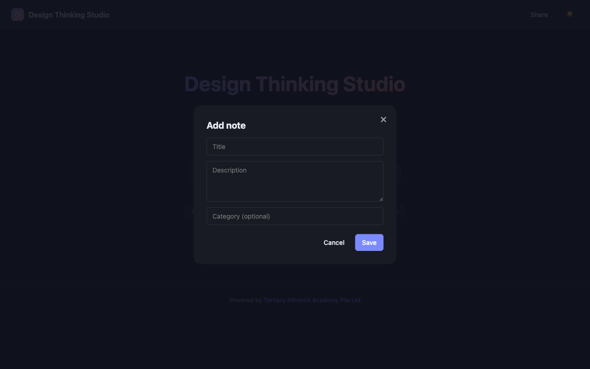

<div align="center">

# Design Thinking Studio

[](https://developer.mozilla.org/docs/Web/HTML)
[](https://developer.mozilla.org/docs/Web/CSS)
[](https://developer.mozilla.org/docs/Web/JavaScript)
[](https://firebase.google.com/)
[](https://pages.github.com/)

**Collaborate, ideate, prototype, and test ideas together — a real-time design thinking workspace.**

[Live Demo](https://alfredang.github.io/designthinking/) · [Report Bug](https://github.com/alfredang/designthinking/issues) · [Request Feature](https://github.com/alfredang/designthinking/issues)

</div>

## Screenshot



## About

Design Thinking Studio is a browser-based collaborative workspace that walks teams through the **5 stages of Design Thinking** — Empathize, Define, Ideate, Prototype, and Test. Create a workspace, share it via QR code, and contribute sticky notes in real time with your collaborators.

### Key Features

| Feature | Description |
|---------|-------------|
| 🧭 5-Stage Stepper | Empathize → Define → Ideate → Prototype → Test |
| 🗒️ Sticky Notes | Add, edit, delete, vote, and resolve in real time |
| 🧠 Empathy Map | Says / Thinks / Does / Feels quadrants |
| 🗳️ Voting | Surface the most important problems and ideas |
| 👥 Live Presence | See active collaborators with avatars and heartbeats |
| 📱 QR Sharing | Scan to join from any device |
| 🌗 Light / Dark Theme | Toggle persisted in localStorage |
| 📐 Responsive | Works on desktop, tablet, and mobile |

## Tech Stack

| Category | Technology |
|----------|-----------|
| Frontend | HTML5, CSS3, vanilla JavaScript (ES Modules) |
| Realtime DB | Firebase Cloud Firestore |
| QR Codes | [qrcodejs](https://github.com/davidshimjs/qrcodejs) (CDN) |
| Hosting | GitHub Pages (via GitHub Actions) |
| Build | None — zero build step, served as static files |

## Architecture

```
┌────────────────────────────────────────────────────────┐
│                     Browser (Client)                   │
│  ┌──────────────┐  ┌──────────────┐  ┌──────────────┐  │
│  │   Landing    │  │  Workspace   │  │  Modals      │  │
│  │  index.html  │  │  + Stepper   │  │  QR / Notes  │  │
│  └──────┬───────┘  └──────┬───────┘  └──────┬───────┘  │
│         └──────────────┬──┴───────────────────┘        │
│                        ▼                               │
│  ┌──────────────────────────────────────────────────┐  │
│  │  app.js · stages.js · notes.js · workspace.js    │  │
│  └─────────────────────┬────────────────────────────┘  │
└────────────────────────┼───────────────────────────────┘
                         │ Firebase JS SDK (modular CDN)
                         ▼
┌────────────────────────────────────────────────────────┐
│             Firebase Cloud Firestore                   │
│  workspaces/{wsId}                                     │
│    ├─ notes/{noteId}    (real-time sticky notes)       │
│    └─ presence/{uid}    (live collaborator heartbeat)  │
└────────────────────────────────────────────────────────┘
```

## Project Structure

```
designthinking/
├── index.html              # Landing + workspace shell
├── styles/
│   ├── main.css            # Themes, layout, responsive
│   └── components.css      # Sticky notes, modals, stepper
├── js/
│   ├── app.js              # Hash routing, theme, init
│   ├── workspace.js        # Create/join, QR, presence
│   ├── stages.js           # 5-stage data-driven config
│   ├── notes.js            # Sticky note CRUD + voting
│   ├── firebase-config.js  # Firebase init + SDK exports
│   └── utils.js            # Helpers (id, time, toast)
├── .github/workflows/
│   └── deploy.yml          # GitHub Pages deployment
├── screenshot.png
└── README.md
```

## Getting Started

### Prerequisites

- A modern browser
- Python 3 (for the local dev server) or any static HTTP server
- A Firebase project with **Cloud Firestore** enabled

### 1. Clone

```bash
git clone https://github.com/alfredang/designthinking.git
cd designthinking
```

### 2. Configure Firebase

1. Create a project at <https://console.firebase.google.com>.
2. Enable **Cloud Firestore** (start in test mode for development).
3. Open [js/firebase-config.js](js/firebase-config.js) and replace the placeholder `firebaseConfig` block with your own web app credentials.

### 3. Run locally

```bash
python3 -m http.server 8000
# open http://localhost:8000
```

Click **Create New Workspace** → enter your name → share the QR code or workspace code with collaborators.

### Firestore rules (development)

```
rules_version = '2';
service cloud.firestore {
  match /databases/{database}/documents {
    match /workspaces/{wsId}/{document=**} {
      allow read, write: if true;
    }
  }
}
```

> ⚠️ Open rules — fine for development, lock down before production.

## Deployment

### GitHub Pages (automatic)

This repo ships with a GitHub Actions workflow at `.github/workflows/deploy.yml` that publishes the project to GitHub Pages on every push to `main`. After enabling Pages once (Settings → Pages → Source: GitHub Actions), the live site updates automatically.

### Any static host

Because there is no build step, you can drag the folder onto Netlify, Vercel, Cloudflare Pages, S3, or serve it from any static host.

## Data Model

```
workspaces/{wsId}
  ├─ createdAt, createdBy
  ├─ notes/{noteId}
  │    stage, section, title, body, category,
  │    author, authorUid, createdAt,
  │    votes { uid: true }, voteCount, resolved
  └─ presence/{uid}
       name, lastSeen
```

## Contributing

1. Fork the repo
2. Create a feature branch: `git checkout -b feat/my-feature`
3. Commit: `git commit -m "feat: add my feature"`
4. Push: `git push origin feat/my-feature`
5. Open a Pull Request

## Developed By

**[Tertiary Infotech Academy Pte Ltd](https://www.tertiarycourses.com.sg/)**

## Acknowledgements

- [Firebase](https://firebase.google.com/) — real-time backend
- [qrcodejs](https://github.com/davidshimjs/qrcodejs) — QR code generation
- The Stanford d.school Design Thinking framework

---

<div align="center">

If you find this useful, please ⭐ the repo!

</div>
